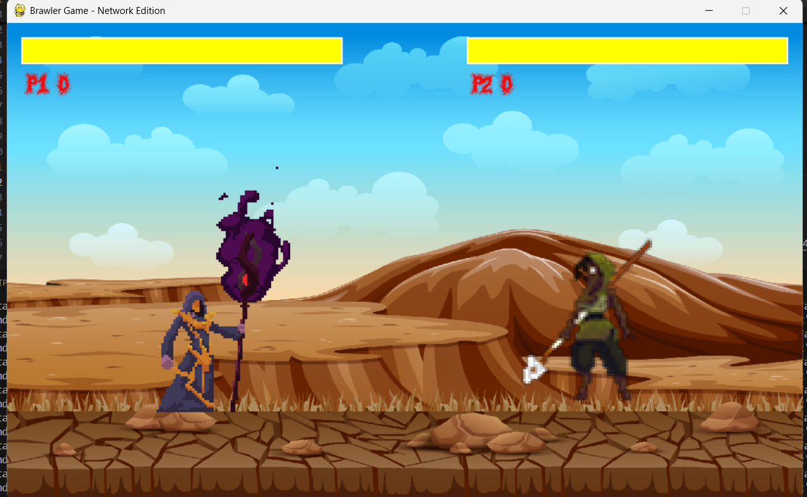
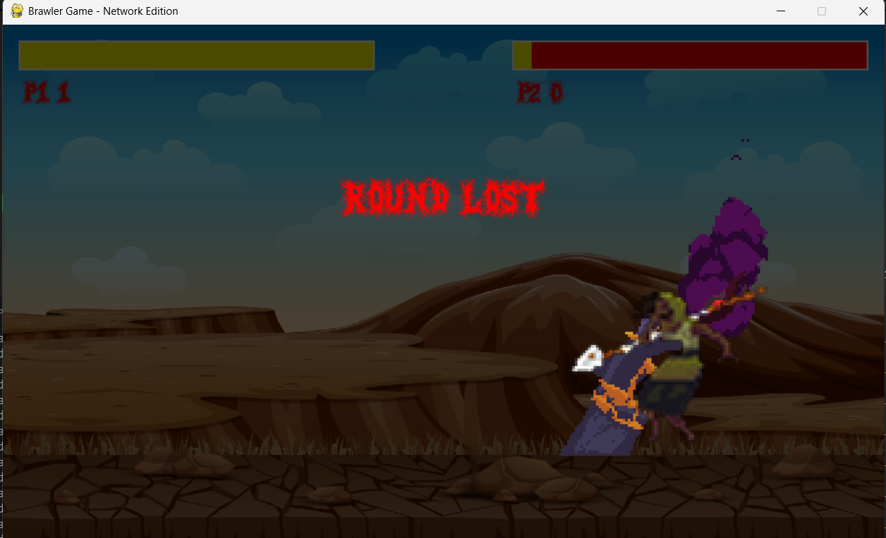
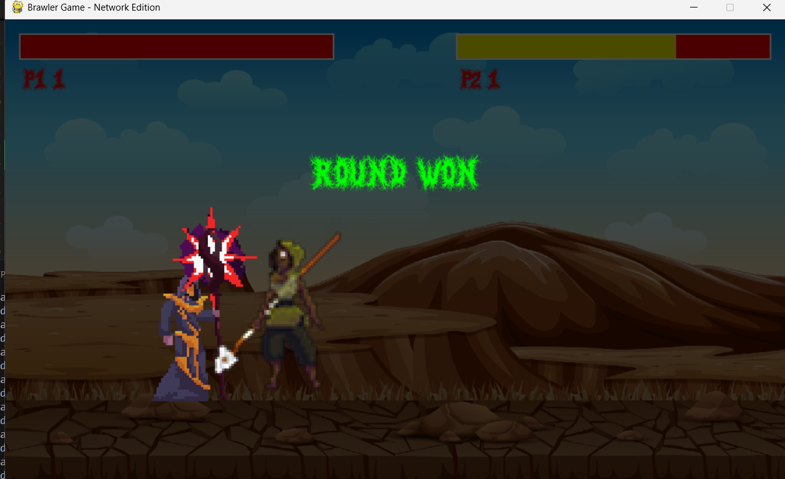
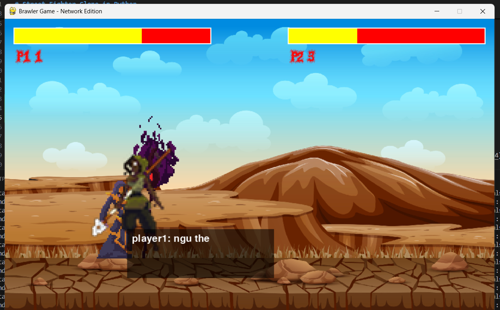
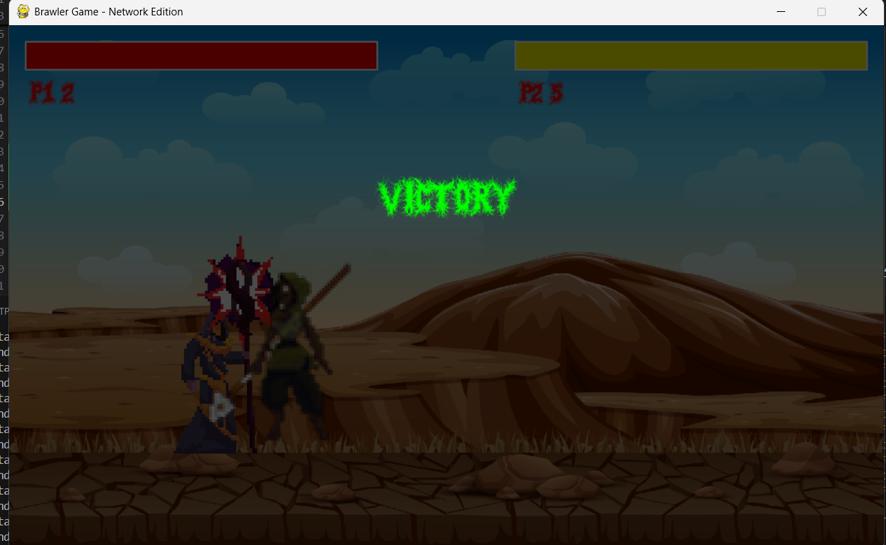

# Street Fighter Clone in Python

## 1. Project Description

This project is a clone of the Street Fighter game, developed using Python and the Pygame library. It also utilizes sockets to enable multiplayer functionality between two clients.

## 2. Tech Stack

- Python 3
- Pygame  
    [Learn more about Pygame](https://www.pygame.org/news)

## 3. Installation and Usage

### Steps to Run the Game:

1. Clone the repository:
     ```bash
     git clone https://github.com/dangthisam/gameBTL.git
     ```

2. Navigate to the project folder:
     ```bash
     cd gameBTL
     ```

3. Start the server:
     ```bash
     python server.py  # For Windows
     python3 server.py # For Linux
     ```

4. Start the client:
     - **On the same machine:**  
         Open two terminals and run:
         ```bash
         python client.py localhost  # For Windows
         python3 client.py localhost # For Linux
         ```
     - **On different machines:**  
         On the machine running `server.py`, find its IP address. On the client machine, run:
         ```bash
         python client.py IPHOST  # For Windows
         python3 client.py IPHOST # For Linux
         ```
         Replace `IPHOST` with the server machine's IP address.

5. In-game chat:  
     During the game, press the `C` key to open the chat dialog box and exchange messages with the other player.

6. Enjoy the game! 😎

## 4. Features

- Multiplayer gameplay using sockets.
- Real-time chat functionality between players.
- Classic Street Fighter-style gameplay.

## 5. Screenshots


## 5. Screenshots

Here are some screenshots from the game:

  
*Figure 1: Main menu of the game.*

  
*Figure 2: Character selection screen.*

  
*Figure 3: In-game battle scene.*

  
*Figure 4: Multiplayer chat feature.*

  
*Figure 5: Victory screen.*

## 6. Demo Video

[Watch the gameplay demo](https://user-images.githubusercontent.com/15172744/190894691-c52ac22d-b76c-4890-9057-98eed66683a9.mp4)

## 7. Contributing

Contributions are welcome! Feel free to fork the repository and submit pull requests.

## 8. Created By

- **Name:** Nguyen Van Sam  
- **Project:** Street Fighter Style Fighting Game in Python using Pygame and Sockets  
- **TikTok:** [@nguyenvvansam](https://www.tiktok.com/@nguyenvvansam)  
- **GitHub:** [dangthisam](https://github.com/dangthisam)

---
Enjoy the game and happy coding!  

